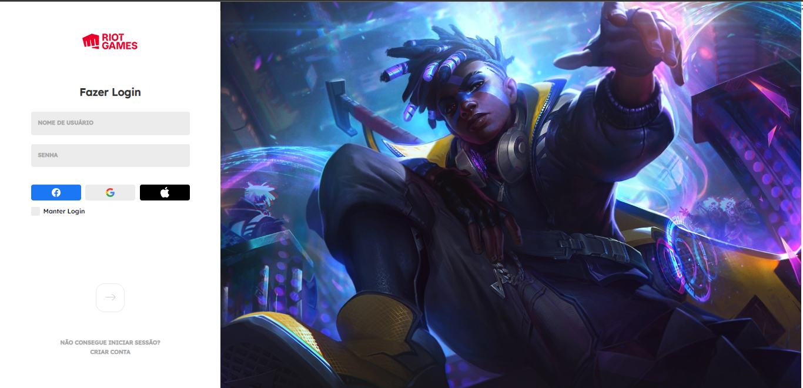

# League of Legends Login Screen

<h2>Descrição</h2>

Recriação da tela de login do LoL em um navegador, utilizando minimamente responsividade.

Com interações das caixas de input mjuito parecidas.

<h2>Como foi feito e como funciona:</h2>

<ul>
    <li>Foi feito utilizando html, css e javascript.</li>
    <li>O botão para prosseguir ao login, utiliza como base os inputs de usuário e senha para sua ativação, ambos devem estar preenchidos.</li>
</ul>

 

Feito com ♥ por Lucas de Lima

Visite meu <a href="https://www.linkedin.com/in/lucas-lima-880aa1206/">Linkedin</a>

